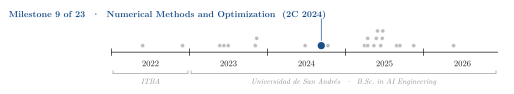
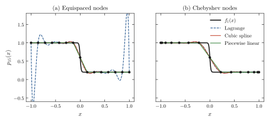
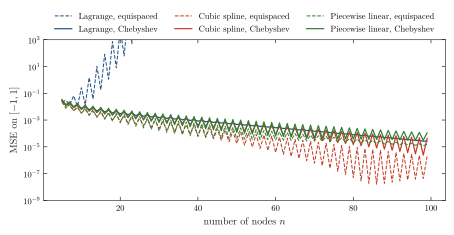
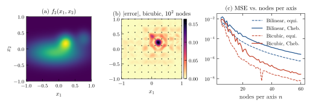
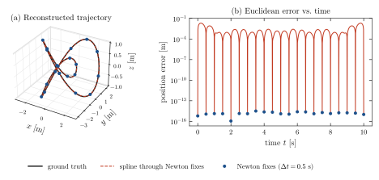

<div align="center">

# Interpolation Node Placement and Newton Trilateration

**Santiago Groba Alonso · [Joaquín Gustavo Di Cola](https://github.com/joaco1212004)**

Universidad de San Andrés · *Numerical Methods and Optimization* · Second semester 2024 · Assignment 1

[](#reproducing-the-results)
[](#reproducing-the-results)
[](LICENSE)

<picture>
  <source media="(prefers-color-scheme: dark)" srcset="docs/figures/trajectory-dark.svg">
  
</picture>

</div>

> **Abstract.** We study how the number and placement of interpolation nodes affect accuracy, and then use interpolation to rebuild a 3D trajectory from range measurements. On the step-like function $f_1(x) = -0.4\tanh(50x) + 0.6$, a degree-14 Lagrange polynomial on equispaced nodes shows the Runge phenomenon (MSE $1.8\times10^{-1}$); moving the same 15 nodes to Chebyshev points reduces the error 28×. Piecewise methods do not need that fix and actually prefer equispaced nodes here, because the only hard region sits in the middle of the interval. In the second part, Newton's method solves the three-sphere trilateration system to machine precision in 5 iterations per fix, and a cubic spline through 21 fixes reconstructs the full trajectory with an RMSE of 4.9 mm.

---

## 1. Problem

The assignment has two parts:

1. **Node placement.** Interpolate the 1D function $f_1(x) = -0.4\tanh(50x) + 0.6$ and the 2D sum of Gaussians $f_2(x_1, x_2)$ on $[-1, 1]$ and $[-1,1]^2$. Start with equispaced nodes, propose a non-uniform rule and compare.
2. **Trilateration.** Three sensors at known positions $s_i$ report the distance $d_i$ to a moving particle every 0.5 s. Recover the particle's position by solving
   $\lVert p - s_i \rVert^2 = d_i^2,\ i = 1,2,3$ with Newton's method, then interpolate the fixes into a continuous trajectory and compare it with the ground truth.

## 2. Methods

| Component | Choice |
|---|---|
| 1D interpolants | Lagrange polynomial (evaluated in barycentric form), cubic spline (not-a-knot), piecewise linear |
| 2D interpolants | Bilinear and bicubic (Clough–Tocher) on a tensor grid, via `scipy.interpolate.griddata` |
| Non-uniform rule | Chebyshev points of the second kind, $x_k = \cos(k\pi/(n-1))$ |
| Error metric | Mean squared error on a dense grid (2001 points in 1D, $120^2$ in 2D) |
| Trilateration | Newton's method on $F(p) = \lVert p - s_i\rVert^2 - d_i^2$, Jacobian $J = 2(p - s_i)^\top$, warm-started from the previous fix |
| Trajectory | Cubic spline through the 21 Newton fixes, evaluated at the 1001 ground-truth instants |

## 3. Results

### 3.1 The Runge phenomenon in one dimension

<p align="center"></p>

**Figure 1.** Interpolating $f_1$ with 15 nodes. (a) On equispaced nodes the Lagrange polynomial oscillates wildly near the endpoints. (b) Chebyshev nodes cluster at the endpoints and suppress the oscillation; the spline and piecewise-linear interpolants are well behaved in both cases.

<p align="center"></p>

**Figure 2.** MSE as a function of the number of nodes. Equispaced Lagrange diverges (beyond the plotted range); Chebyshev Lagrange converges. The sawtooth comes from parity: an odd $n$ places a node exactly on the jump at $x = 0$.

**Table 1.** Mean squared error of each 1D scheme on $f_1$.

| Method | $n$ | Equispaced | Chebyshev |
|---|---:|---:|---:|
| Lagrange | 15 | $1.82\times10^{-1}$ | $\mathbf{6.41\times10^{-3}}$ |
| Lagrange | 50 | $3.04\times10^{19}$ | $\mathbf{4.67\times10^{-4}}$ |
| Cubic spline | 15 | $\mathbf{3.65\times10^{-3}}$ | $6.97\times10^{-3}$ |
| Cubic spline | 50 | $\mathbf{1.77\times10^{-5}}$ | $1.80\times10^{-4}$ |
| Piecewise linear | 15 | $\mathbf{4.79\times10^{-3}}$ | $8.90\times10^{-3}$ |
| Piecewise linear | 50 | $\mathbf{3.95\times10^{-5}}$ | $1.17\times10^{-4}$ |

Chebyshev nodes fix a problem of *global* polynomials. Piecewise methods have no Runge phenomenon, so for them the only thing that matters is node density where the function changes fastest, and for $f_1$ that is the center, where Chebyshev points are sparsest.

### 3.2 Two dimensions

<p align="center"></p>

**Figure 3.** (a) The target $f_2$. (b) Absolute error of bicubic interpolation on a $10\times10$ equispaced grid; the error is concentrated on the sharp peak. (c) MSE versus nodes per axis: bicubic pulls ahead of bilinear as the grid is refined (65× lower MSE at 30 nodes per axis), and equispaced grids beat tensor Chebyshev grids for the same reason as in 1D.

### 3.3 Trilateration

<p align="center"></p>

**Figure 4.** (a) Ground-truth trajectory, Newton fixes and the spline reconstruction. (b) Euclidean error over time: the fixes are exact to $10^{-15}$ m (the measurements are noise-free), and the error between fixes is the spline's interpolation error.

**Table 2.** Trilateration summary.

| Quantity | Value |
|---|---:|
| Newton iterations per fix (mean / max) | 5.0 / 5 |
| Maximum error at the fixes | $3.2\times10^{-15}$ m |
| Spline trajectory error: mean / max | 2.6 mm / 20.2 mm |
| Spline trajectory RMSE | 4.9 mm |

## 4. Takeaways

- Node placement is a property of the *method*, not of the problem: Chebyshev points are the cure for global polynomial interpolation and can hurt local schemes.
- Warm-starting Newton from the previous fix gives quadratic convergence in a handful of steps, so the bottleneck of the pipeline is the sampling rate, not the solver.

## Reproducing the results

```bash
pip install numpy scipy matplotlib
python docs/figures/make_figures.py   # regenerates every figure and prints Tables 1–2
```

The scripts submitted with the assignment are kept as they were:

| File | Content |
|---|---|
| `interpolacion.py`, `Fa_interpolaciones.py` | 1D experiments on $f_1$ |
| `Fb_interpolaciones.py` | 2D experiments on $f_2$ |
| `trilateracion.py` | Newton trilateration and spline reconstruction |
| `sensor_positions.txt`, `measurements.txt`, `trajectory.txt` | Data provided by the course |
| `MNyO_TP01.pdf` | Assignment statement (Spanish) |
| `docs/figures/` | Script and style used for the figures in this README |

## Citation

```bibtex
@misc{groba2024interpolation,
  author       = {Groba Alonso, Santiago and Di Cola, Joaqu{\'i}n Gustavo},
  title        = {Interpolation Node Placement and Newton Trilateration},
  year         = {2024},
  howpublished = {Universidad de San Andr{\'e}s, Numerical Methods and Optimization},
  url          = {https://github.com/Santi2065/interpolation-and-trilateration}
}
```
